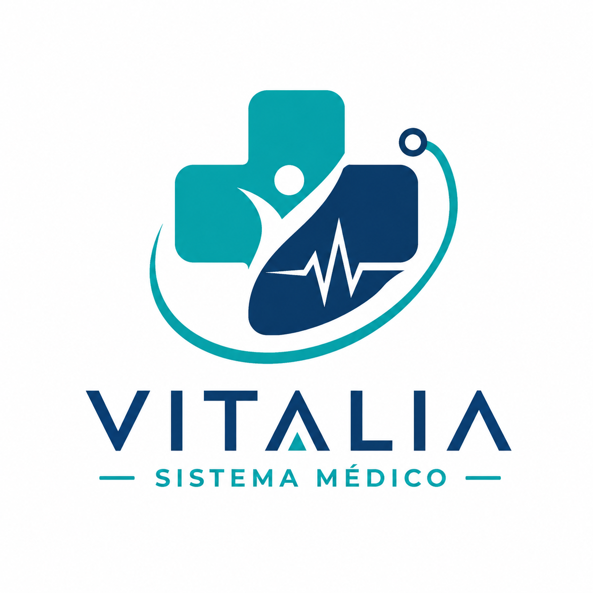

<div align="center">

# 🏥 Sistema Médico Vitalia



### Sistema web para la gestión de pacientes y citas médicas

Desarrollado con **Angular + FastAPI**

</div>

---

# 📖 Descripción

**Sistema Médico Vitalia** es una aplicación web desarrollada para la administración de pacientes y el agendamiento de citas médicas.

El sistema permite registrar pacientes, iniciar sesión, administrar la información del usuario, consultar la disponibilidad de médicos por especialidad, agendar citas médicas y visualizar un dashboard con información personalizada del paciente.

---

# 👥 Integrantes

- **Stefanie Avila**
- **Maydene Madero**

**Materia:** Ingeniería de Software

**Grupo:** 02

---

# ✨ Funcionalidades

- 👤 Registro de pacientes.
- 🔐 Inicio de sesión.
- ✏️ Edición del perfil.
- 🗑 Eliminación de cuenta.
- 📅 Agendamiento de citas médicas.
- 👨‍⚕️ Consulta de disponibilidad de médicos.
- 🩺 Filtrado de médicos por especialidad.
- 📋 Visualización de citas agendadas.
- 📊 Dashboard con estadísticas del paciente.
- ⏰ Visualización de la próxima cita médica.

---

# 🛠 Tecnologías Utilizadas

| Tecnología | Descripción |
|------------|-------------|
| Angular | Desarrollo del Frontend |
| TypeScript | Lógica del cliente |
| HTML5 | Estructura de la interfaz |
| CSS3 | Diseño y estilos |
| Python | Desarrollo del Backend |
| FastAPI | API REST |
| Uvicorn | Servidor ASGI |
| Git | Control de versiones |
| GitHub | Repositorio del proyecto |

---

# 🏗 Arquitectura

```
                Frontend (Angular)
                        │
                 HTTP / JSON
                        │
                        ▼
               Backend (FastAPI)
                        │
                        ▼
        Almacenamiento en memoria
```

---

# 📁 Estructura del Proyecto

```
Sistema-Medico-Vitalia
│
├── frontend-angular/
│   ├── src/
│   ├── public/
│   └── package.json
│
├── T02.3_Ingenieria_Software/
│   ├── app/
│   ├── tests/
│   ├── requirements.txt
│   └── README.md
│
├── logo.png
└── README.md
```

---

# 📋 Requisitos Previos

Antes de ejecutar el proyecto asegúrese de tener instalado:

- Python 3.9 o superior.
- Node.js y npm.
- Git.

---

# 🚀 Instalación

## 1️⃣ Clonar el repositorio

```bash
git clone https://github.com/StefanieAvila05/sistema-medico-vitalia.git

cd sistema-medico-vitalia
```

---

## 2️⃣ Ejecutar el Backend

Ingresar a la carpeta:

```bash
cd T02.3_Ingenieria_Software
```

Instalar dependencias:

```bash
pip install -r requirements.txt
```

Iniciar FastAPI:

```bash
uvicorn app.main:app --reload
```

La documentación Swagger estará disponible en:

```
http://127.0.0.1:8000/docs
```

---

## 3️⃣ Ejecutar el Frontend

Abrir una nueva terminal e ingresar a:

```bash
cd frontend-angular
```

Instalar dependencias:

```bash
npm install
```

Iniciar Angular:

```bash
ng serve
```

Abrir el navegador en:

```
http://localhost:4200
```

---

# 📸 Capturas del Sistema

## Inicio de sesión


---

## Dashboard


---

## Agendar cita


---

## Mis citas


---

# 📌 Estado del Proyecto

Actualmente el sistema implementa:

- ✅ Gestión de pacientes.
- ✅ Gestión de citas médicas.
- ✅ Dashboard interactivo.
- ✅ Consulta de disponibilidad médica.
- ✅ API REST documentada mediante Swagger.
- ✅ Interfaz web desarrollada en Angular.

---

# 📄 Licencia

Proyecto desarrollado con fines académicos para la asignatura **Ingeniería de Software**.
